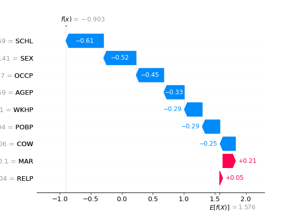
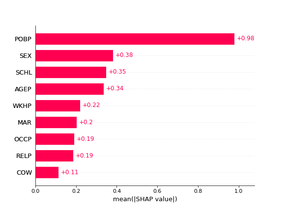

Explanation Shift Detector
===================================

This tutorial enables to measures of explanation shifts as way to detect model shifting behaviour.
As we have discussed inthe paper, it can provide more insights than measures of the input distribution and prediction shift when monitoring machine learning models. 

In this section we provide examples of usage over two different datasets.
The first one the shift is generated synthetically and in the second one is a natural shift.

.. note::

   This project is under active development.

Breast Cancer Dataset
------------------------

Importing libraries

.. code:: python

    import numpy as np
    from sklearn.datasets import make_blobs
    from xgboost import XGBRegressor
    from sklearn.linear_model import LogisticRegression
    from sksfhift import ExplanationShiftDetector

Generate synthetic ID and OOD data.

.. code:: python

    # Real World Example
    from sklearn import datasets

    # import some data to play with
    dataset = datasets.load_breast_cancer()
    X = dataset.data[:, :5]
    y = dataset.target
    X_tr, X_te, y_tr, y_te = train_test_split(X, y, test_size=0.5, random_state=0)

    X_ood = X.copy()
    X_ood[:, 0] = X_ood[:, 0] + 3
    # Split in train and test
    X_ood_tr, X_ood_te, y_ood_tr, y_ood_te = train_test_split(
        X_ood, y, test_size=0.5, random_state=0
    )
    # Concatenate for new dataset
    X_new = np.concatenate([X_te, X_ood_te])
    y_new = np.concatenate([np.zeros_like(y_te), np.ones_like(y_ood_te)])

Fit Explanation Shift Detector whith model and detector being an xgboost

.. code:: python

    detector = ExplanationShiftDetector(model=XGBClassifier(), gmodel=XGBClassifier())

    detector.fit_pipeline(X_tr, y_tr, X_te, X_ood_tr)

    roc_auc_score(y_new,detector.predict_proba(X_new)[:,1])
    # 0.93
   
If the AUC is above 0.5 then we can expect and change on the model predictions.
Now we can proceed to explain how the model changed between test and OOD data.

The intuition of this explanations is *what are the features driving OOD model behaviour?*

.. code:: python

    # Explaining the change of the model
    import shap
    explainer = shap.Explainer(detector.detector, masker=detector.get_explanations(X))
    shap_values = explainer(detector.get_explanations(X_ood_te))
    shap.waterfall_plot(shap_values[0])
    shap.plots.bar(shap_values)

.. image:: images/breastShapLocal.png
  :width: 600
  :alt: Alternative text

.. image:: images/breastShapGlobal.png
  :width: 600
  :alt: Alternative text

As the model used is a XGBoost we can see that even if we shift
a univariate feature the model detects correlation with other features that
are modifying model behaviour

Folktables: US Income Dataset
------------------------------------

In this case we use the US Income dataset. 
The dataset is available in the `Folktables <https://github.com/socialfoundations/folktables>`_ repository.

We generate a geopolitical shift by training on California data and evaluating on other states.

.. code:: python

    from folktables import ACSDataSource, ACSIncome
    import pandas as pd

    data_source = ACSDataSource(survey_year="2018", horizon="1-Year", survey="person")
    ca_data = data_source.get_data(states=["CA"], download=True)
    pr_data = data_source.get_data(states=["PR"], download=True)
    ca_features, ca_labels, _ = ACSIncome.df_to_pandas(ca_data)
    pr_features, pr_labels, _ = ACSIncome.df_to_pandas(pr_data)

    # Split ID data and OOD train and test data
    X_tr, X_te, y_tr, y_te = train_test_split(
        ca_features, ca_labels, test_size=0.5, random_state=0
    )
    X_ood_tr, X_ood_te, y_ood_tr, y_ood_te = train_test_split(
        pr_features, pr_labels, test_size=0.5, random_state=0
    )
    X_new = pd.concat([X_te, X_ood_te])
    y_new = np.concatenate([np.zeros_like(y_te), np.ones_like(y_ood_te)])

    # Fit the model
    model = XGBClassifier().fit(X_tr, y_tr)

The model is trained on CA data, and evaluated on data with OOD

.. code:: python

    detector = ExplanationShiftDetector(model=model, gmodel=XGBClassifier())
    detector.fit_detector(X_te, X_ood_te)
    roc_auc_score(y_new, detector.predict_proba(X_new)[:, 1])
    # 0.96

The AUC is high which means that the model is changing. We can now proceed to inspect the model behaviour change.

.. code:: python

    explainer = shap.Explainer(detector.detector)
    shap_values = explainer(detector.get_explanations(X_new))

    # Local Explanations for instance 0
    shap.waterfall_plot(shap_values[0])

    # Global Explanations
    fig = shap.plots.bar(shap_values)

 We proceed to the explanations of the *Explanation Shift Detector*

Above local explanations, below global explanations

Now we can proceed to do the same with a less OOD data, the US Income from the state of Michigan.

.. code:: python

    # Now if we choose a differet OOD data
    tx_data = data_source.get_data(states=["TX"], download=True)
    tx_features, tx_labels, _ = ACSIncome.df_to_pandas(tx_data)

    # Split data
    X_tr, X_te, y_tr, y_te = train_test_split(
        ca_features, ca_labels, test_size=0.5, random_state=0
    )
    X_ood_tr, X_ood_te, y_ood_tr, y_ood_te = train_test_split(
        tx_features, tx_labels, test_size=0.5, random_state=0
    )
    X_new = pd.concat([X_te, X_ood_te])
    y_new = np.concatenate([np.zeros_like(y_te), np.ones_like(y_ood_te)])
    detector = ExplanationShiftDetector(model=model, gmodel=XGBClassifier())

    detector.fit_detector(X_te, X_ood_te)
    print(roc_auc_score(y_new, detector.predict_proba(X_new)[:, 1]))
    # 0.82

We can see how the AUC of the model is different.
And proceed to inspect the model behaviour change.
The local explanations:

.. image:: images/folksShapLocalMI.png
  :width: 400
  :alt: Alternative text

The global explanations:

.. image:: images/folkstShapGlobalMI.png
  :width: 400
  :alt: Alternative text

We can see how the model behaviour is changing between the two states.
By comparing the images we can see that the feature attributions to the reasons of the OOD explanation are distinct between the data two states.