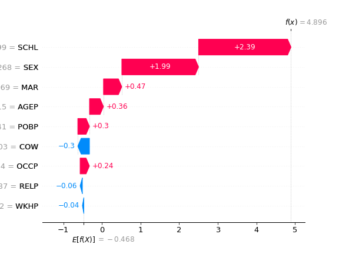
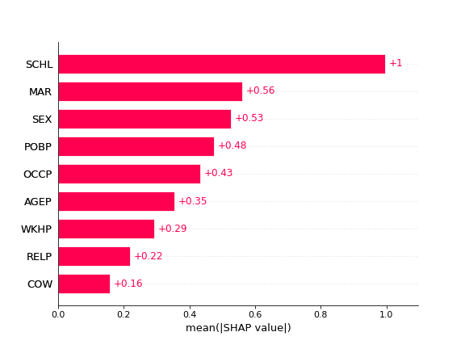

Equal Treatment Inspector
===================================

This tutorial enables to measure equal treatment via de the explanation space.
As we have discussed inthe paper, it can provide more insights than measures of un-equal treatment of a ML model .
The full code for the tutorial is in `tutorial.py` of the main folder

In this section we provide examples of usage over two different datasets.
The first one the un-equal treatment is generated synthetically and in the second one is a real dataset.

.. note::

   This project is under active development.

Synthetic example
--------------------------

Importing libraries

.. code:: python

   from sklearn.model_selection import train_test_split
   from sklearn.datasets import make_blobs
   from nobias import ExplanationAudit
   from xgboost import XGBClassifier
   from sklearn.linear_model import LogisticRegression
   from sklearn.metrics import roc_auc_score
   import pandas as pd
   import numpy as np
   import random
   import matplotlib.pyplot as plt
   random.seed(0)

Let's generate a synthetic dataset with a protected attribute and a target variable.

.. code:: python

   X, y = make_blobs(n_samples=2000, centers=2, n_features=5, random_state=0)
   X = pd.DataFrame(X, columns=["a", "b", "c", "d", "e"])
   # Protected att
   X["a"] = np.where(X["a"] > X["a"].mean(), 1, 0)

   # Train Val Holdout Split
   X_tr, X_te, y_tr, y_te = train_test_split(X, y, test_size=0.5, random_state=0)
   X_hold, X_te, y_hold, y_te = train_test_split(X_te, y_te, test_size=0.5, random_state=0)

   z_tr = X_tr["a"]
   z_te = X_te["a"]
   z_hold = X_hold["a"]
   X_tr = X_tr.drop("a", axis=1)
   X_te = X_te.drop("a", axis=1)
   X_hold = X_hold.drop("a", axis=1)
   # Random
   z_tr_ = np.random.randint(0, 2, size=X_tr.shape[0])
   z_te_ = np.random.randint(0, 2, size=X_te.shape[0])
   z_hold_ = np.random.randint(0, 2, size=X_hold.shape[0])

Now there is two training options that are equivalent, 
either passing a trained model and just training the Inspector

Fit ET Inspector where the classifier is a Gradient Boosting Decision Tree and the Detector a logistic regression. Any other classifier or detector can be used.

.. code:: python

   # Option 1: fit the auditor when there is a trained model
   model = XGBClassifier().fit(X_tr, y_tr)

   auditor = ExplanationAudit(model=model, gmodel=LogisticRegression())

   auditor.fit_inspector(X_hold, z_hold)
   print(roc_auc_score(z_te, auditor.predict_proba(X_te)[:, 1]))
   # 0.84

Or fit the whole pipeline without previous retraining.
If the AUC is above 0.5 then we can expect and change on the model predictions.

.. code:: python

   # Option 2: fit the whole pipeline of model and auditor at once
   auditor.fit_pipeline(X=X_tr, y=y_tr, z=z_tr)
   print(roc_auc_score(z_te, auditor.predict_proba(X_te)[:, 1]))
   # 0.83

   # If we fit to random protected att, there is no performance
   # We fit in the previous generated random data
   auditor.fit_pipeline(X=X_tr, y=y_tr, z=z_tr_)
   print(roc_auc_score(z_te_, auditor.predict_proba(X_te)[:, 1]))
   # 0.5

Folktables: US Income Dataset
------------------------------------

In this case we use the US Income dataset. 
The dataset is available in the `Folktables <https://github.com/socialfoundations/folktables>`_ repository.

We generate a geopolitical shift by training on California data and evaluating on other states.

.. code:: python

   # Real World Example - Folktables
   from folktables import ACSDataSource, ACSIncome
   import pandas as pd

   data_source = ACSDataSource(survey_year="2018", horizon="1-Year", survey="person")
   ca_data = data_source.get_data(states=["CA"], download=True)
   ca_features, ca_labels, ca_group = ACSIncome.df_to_pandas(ca_data)
   ca_features = ca_features.drop(columns="RAC1P")
   ca_features["group"] = ca_group
   ca_features["label"] = ca_labels
   # Lets focus on groups 1 and 6
   ca_features = ca_features[ca_features["group"].isin([1, 6])]

   # Split train, test and holdout
   X_tr, X_te, y_tr, y_te = train_test_split(
      ca_features.drop(columns="label"), ca_features.label, test_size=0.5, random_state=0
   )
   X_hold, X_te, y_hold, y_te = train_test_split(X_te, y_te, test_size=0.5, random_state=0)
   # Prot att.
   z_tr = np.where(X_tr["group"].astype(int) == 6, 0, 1)
   z_te = np.where(X_te["group"].astype(int) == 6, 0, 1)
   z_hold = np.where(X_hold["group"].astype(int) == 6, 0, 1)
   X_tr = X_tr.drop("group", axis=1)
   X_te = X_te.drop("group", axis=1)
   X_hold = X_hold.drop("group", axis=1)
   # Fit the model
   model = XGBClassifier().fit(X_tr, y_tr)

The model is trained on CA data, where we measure un-equal treatment between two ethnic groups 1 and 6

.. code:: python

   auditor = ExplanationAudit(model=model, gmodel=XGBClassifier())

   auditor.fit_inspector(X_te, z_te)
   print(roc_auc_score(z_hold, auditor.predict_proba(X_hold)[:, 1]))

The AUC is high which means that there is unequal treatment.
 We can now proceed to inspect the reason behind this un-equal treatment

.. code:: python

   explainer = shap.Explainer(auditor.inspector)

   shap_values = explainer(auditor.get_explanations(X_hold))
   # Local Explanations
   shap.waterfall_plot(shap_values[0], show=False)

   # Global Explanations
   hap.plots.bar(shap_values, show=False)

 We proceed to the explanations of the *Explanation Shift Detector*

.. image:: images/folksShapLocal.png
  :width: 400
  :alt: Alternative text

Above local explanations, below global explanations

.. image:: images/folkstShapGlobal.png
  :width: 400
  :alt: Alternative text

Now we can proceed to do the same with another pair of groups

.. code:: python

    # Now if we choose a differet another groups
   ca_features, ca_labels, ca_group = ACSIncome.df_to_pandas(ca_data)
   ca_features = ca_features.drop(columns="RAC1P")
   ca_features["group"] = ca_group
   ca_features["label"] = ca_labels
   # Lets focus on groups 1 and 6
   ca_features = ca_features[ca_features["group"].isin([8, 6])]
   # %%
   # Split train, test and holdout
   X_tr, X_te, y_tr, y_te = train_test_split(
      ca_features.drop(columns="label"), ca_features.label, test_size=0.5, random_state=0
   )
   X_hold, X_te, y_hold, y_te = train_test_split(X_te, y_te, test_size=0.5, random_state=0)
   # Prot att.
   z_tr = np.where(X_tr["group"].astype(int) == 6, 0, 1)
   z_te = np.where(X_te["group"].astype(int) == 6, 0, 1)
   z_hold = np.where(X_hold["group"].astype(int) == 6, 0, 1)
   X_tr = X_tr.drop("group", axis=1)
   X_te = X_te.drop("group", axis=1)
   X_hold = X_hold.drop("group", axis=1)

   model = XGBClassifier().fit(X_tr, y_tr)
   auditor = ExplanationAudit(model=model, gmodel=XGBClassifier())

   auditor.fit_inspector(X_te, z_te)
   print(roc_auc_score(z_hold, auditor.predict_proba(X_hold)[:, 1]))

We can see how the AUC of the model is different.
And proceed to inspect the differences
The local explanations:

The global explanations:

We can see how the model behaviour is changing between the two protecte groups.
By comparing the images we can see that the feature attributions to the reasons of unequal treatment are distinct between the data two states.